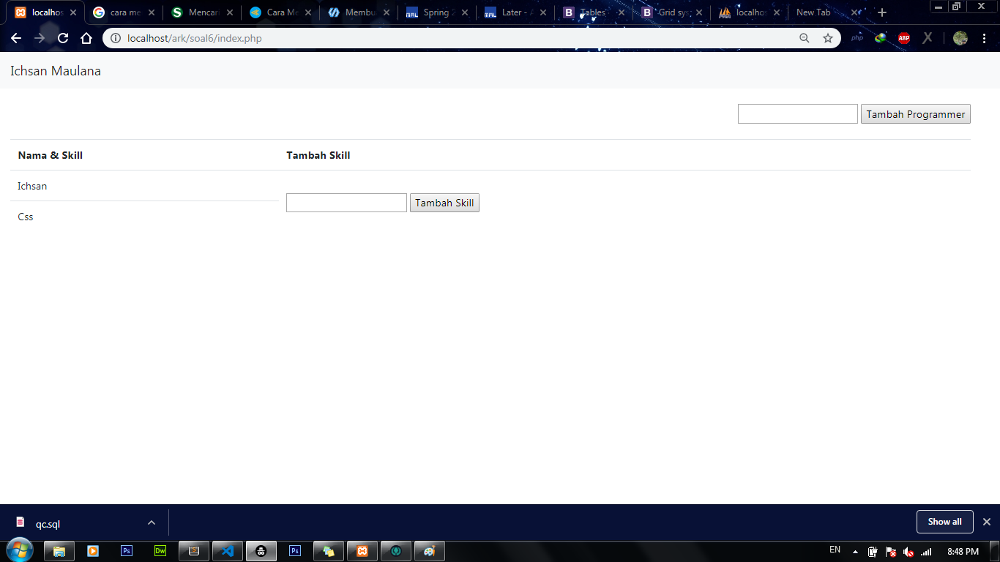
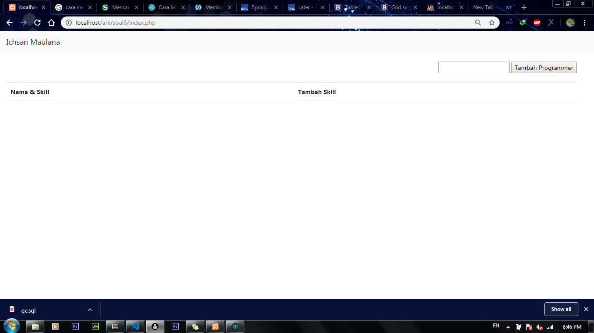

# ark
Menggunakan bahasa pemrograman php css dan twitter bootsrap

apa itu REST API?
REST (REpresentational State Transfer) merupakan standar arsitektur komunikasi berbasis web yang sering diterapkan dalam pengembangan layanan berbasis web. Umumnya menggunakan HTTP (Hypertext Transfer Protocol) sebagai protocol untuk komunikasi data. REST pertama kali diperkenalkan oleh Roy Fielding pada tahun 2000.

Pada arsitektur REST, REST server menyediakan resources(sumber daya/data) dan REST client mengakses dan menampilkan resource tersebut untuk penggunaan selanjutnya. Setiap resource diidentifikasi oleh URIs (Universal Resource Identifiers) atau global ID. Resource tersebut direpresentasikan dalam bentuk format teks, JSON atau XML. Pada umumnya formatnya menggunakan JSON dan XML.

#after

#before

#proses
